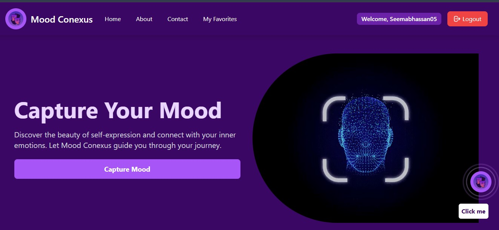
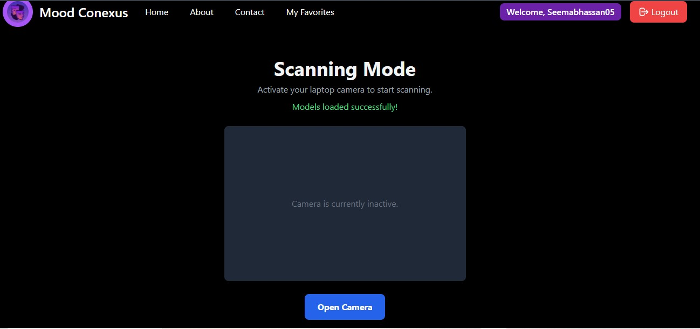
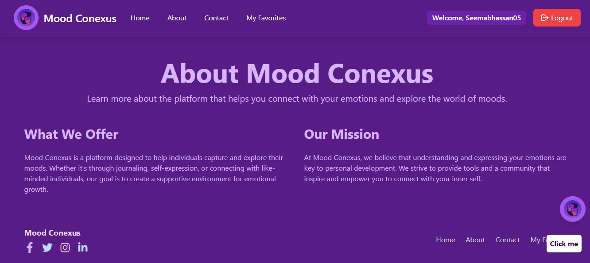

# 🎭 Mood Conexus – Real-Time Emotion-Based Recommendation System

**Mood Conexus** is an AI-powered full-stack application that detects user emotions in real time via webcam and recommends personalized **books** and **anime** based on emotional context. It combines emotion recognition, NLP chatbot assistance, and smart filtering logic to provide a mood-aware recommendation experience.

---

## 🎯 Core Features

- 🎥 **Real-Time Emotion Detection** using face expressions from webcam
- 📚 **Smart Recommendations** for anime & books based on emotional context
- 🤖 **Interactive Chatbot Assistant** powered by Groq + LLaMA 3
- 🔐 **Secure Backend** API with Flask and Firebase
- 💬 **User-Friendly Interface** built with React + Tailwind
- 🌐 **Full-Stack Integration** between React frontend and Flask backend

---

## 🧠 How It Works

1. **Emotion Detection**
   - The webcam captures the user's facial expression using `face-api.js`.
   - Detected emotions (e.g., happy, sad, angry) are sent to the backend.

2. **Recommendation Logic**
   - Pre-labeled datasets (books & anime) with emotion tags are filtered using Python logic based on the emotion received.

3. **Chatbot Assistant**
   - Users can interact with a chatbot (powered by LLaMA 3 via Groq API) to ask for recommendations or explore based on preferences.

4. **Result Display**
   - Recommended books and anime appear with thumbnails, descriptions, and previews.

---

## 🛠️ Tech Stack

| Layer        | Tech / Tools                                 |
|--------------|----------------------------------------------|
| **Frontend** | React, Vite, Tailwind CSS, face-api.js       |
| **Backend**  | Flask, pandas, NumPy, Firebase               |
| **AI/NLP**   | LLaMA 3 (via Groq API), emotion detection    |
| **Database** | Firebase Firestore                           |
| **Others**   | GitHub, Render (deployment), Python 3.x      |

---

## 🧾 Project Structure

```

mood-conexus/
├── backend/
│ ├── models/ # Data models
│ ├── firebase_config.py # Firebase setup
│ ├── app.py # Flask backend API
│ ├── chat.py # LLaMA 3 Chatbot integration

├── frontend/
│ ├── public/ # Static assets & index.html
│ ├── src/
│ │ ├── components/ # React components (Chatbot, Home,About,Favourites etc.)
│ │ ├── firebase.js # Firebase client config
│ │ ├── App.jsx # Root app
│ │ └── main.jsx # Entry point
│ ├── .env # API keys (excluded)
│ ├── tailwind.config.js # Tailwind setup
│ └── vite.config.js # Vite setup

```


---

## 📈 Datasets

- `anime_with_emotions.xlsx`: 10,000+ anime entries with title, emotion, genre, rating, preview
- `book_dataset.xlsx`: 8,000+ books with emotional genres, mood classification, and ratings

---

## ⚙️ Running the Project Locally

### 📦 Prerequisites

- Node.js v18+
- Python 3.9+
- Firebase account (for Firestore & storage)
- Groq API key (for LLaMA 3 access)

---

### 🔧 Setup Backend

```bash
cd backend
# (Optional) Create virtual environment
python -m venv env
source env/bin/activate  # Or env\Scripts\activate on Windows

# Install dependencies
pip install -r requirements.txt

# Run Flask server
python app.py
```


### 🖥️ Setup Frontend
```bash

cd frontend
npm install
npm run dev
```
The React app will open at http://localhost:5173/
Ensure backend is running at http://localhost:5000/ for proper communication.

### 🧪 Test Cases

| Scenario                              | Input Type       | Input Description                                  | Expected Behavior                                                   |
|---------------------------------------|------------------|----------------------------------------------------|---------------------------------------------------------------------|
| Webcam detects "happy"               | Facial Emotion   | User's face expresses a "happy" emotion            | System recommends cheerful anime and uplifting books                |
| Webcam detects "sad"                 | Facial Emotion   | User's face shows signs of sadness                 | System recommends comforting, empathetic, or inspirational content  |
| Webcam detects "angry"               | Facial Emotion   | User displays anger or frustration facial cues     | System suggests calming, soothing, or motivational recommendations  |
| No webcam permission granted         | System Limitation| User denies camera access permission               | Fallback: User is prompted to manually select emotion               |
| No detectable face in camera frame   | System Limitation| Face not properly visible or lighting is poor      | Error prompt shown; user asked to adjust position or lighting       |
| Chatbot: "I feel stressed today"     | Chatbot Input    | Emotionally expressive message entered manually    | AI detects emotion context and recommends stress-relief content     |
| Chatbot: "Give me something to cheer me up" | Chatbot Input | User requests cheerful or mood-lifting suggestions | Assistant provides light-hearted recommendations                    |
| Emotion not found in dataset         | Backend Response | A rare or undefined emotion is detected            | Default suggestions or prompt to try again                          |
| Backend server offline               | System Failure   | Flask API is not reachable                         | Error message shown in frontend, with retry or offline fallback     |
| API key invalid/missing              | Configuration    | Groq or Firebase credentials missing or incorrect  | Secure error logging + notification to developer                    |

## 🖼️ Project Screenshots

### 🏠 Homepage Views

#### 🔹 Main Homepage


#### 🔹 Alternate Homepages
  


---

### 🤖 Chatbot Conversations

#### 💬 Chat Interaction 1


#### 💬 Chat Interaction 2


---

### 📸 Emotion Capture Interface

#### 🎥 Mood Capture Screen


---

### 📇 Informational Sections

#### 📖 About Page


#### 📬 Contact Page


---

### ❤️ User Favorites & Recommendations

#### ⭐ Favorite Anime/Books
  


#### 📚 Personalized Recommendations
  


### 📄 License
This project is licensed under the MIT License.
Feel free to fork, modify, and use for educational purposes.

🙋‍♀️ Author
Seemab Hassan

### 🔐 Security & Secrets
DO NOT UPLOAD the following files to GitHub:
```
.env

serviceAccountKey.json
```
